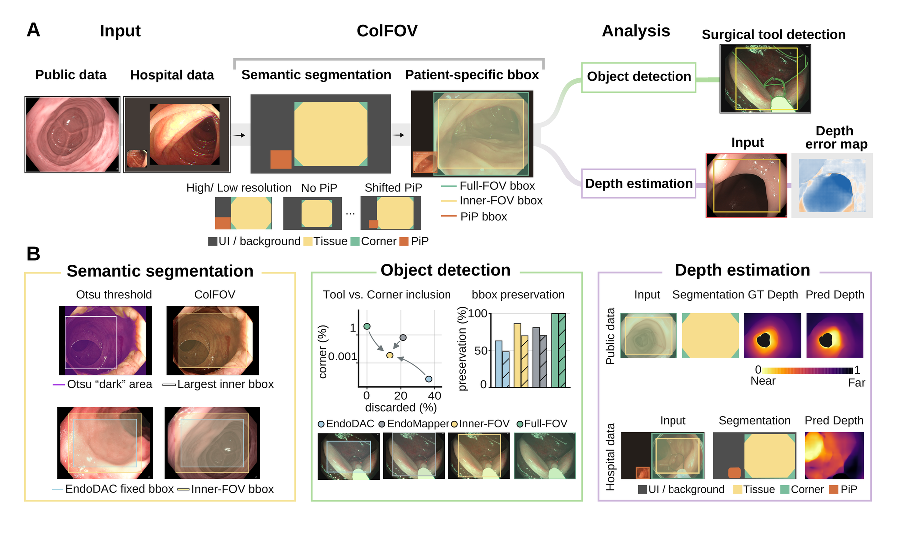
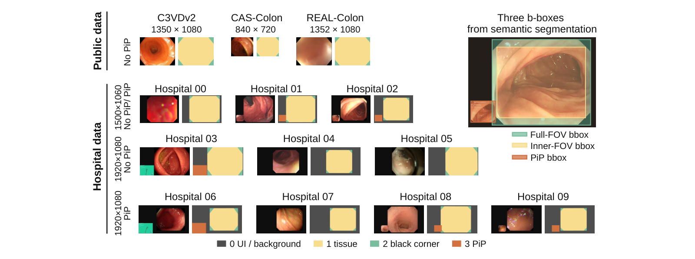

# ColFOV

[한국어](README.ko.md)

An endoscopic frame is not a clean image. It carries the optical field plus black
corners, a processor UI border, letterbox padding, and sometimes a picture-in-picture
window. Send that whole frame to a downstream model — depth, detection,
classification — and a large share of the pixels are not tissue at all.

ColFOV finds the part that is, and gives you rectangles you can crop with.

Code and model weights are publicly available for scientific transparency. This is
**not** open-source software — see [License](#license).

The commands below document the released interface. The repository license does not
grant permission to execute or otherwise use the code or weights; prior written
permission from the copyright holder is required.



## When this is useful

- You are about to run depth, detection or classification on colonoscopy frames and
  want the UI and black borders gone first.
- Your recordings come from more than one processor or site, so a hardcoded crop
  rectangle does not transfer between them.
- A picture-in-picture window appears mid-procedure and you need to know **when** it is
  there and **where** — not assume a fixed corner.
- You want a preprocessing step that refuses to guess: when the evidence is missing it
  returns `null` and a reason, instead of a plausible-looking wrong box.

Not for real-time capture-card pipelines — this is offline replay — and not for
anything clinical.

## What comes out

The network produces one thing: a per-pixel class map.

```
mask[y, x] ∈ {0, 1, 2, 3}
```

| value | class | what it is |
|---:|---|---|
| 0 | `background_ui` | processor UI, letterbox, anything outside the optics |
| 1 | `valid_fov_tissue` | usable endoscopic tissue |
| 2 | `black_corner` | dark peripheral region inside the frame |
| 3 | `popup_overlay` | an overlaid sub-window |



Everything else is **geometry computed from those masks** — three rectangles, in the
coordinates of your own frame:

| box | what it bounds | typical use |
|---|---|---|
| `inner_fov_box` | a fixed 1.25-aspect rectangle fitting **inside** stable tissue | model input crop: no UI, no black corner, no padding |
| `full_fov_box` | the bounding rectangle of the whole stable field | display, or a crop that must not lose peripheral field |
| `active_session_pip_box` | the picture-in-picture window live at that instant | route the sub-view separately, or exclude it from the main crop |

## Using the boxes

Boxes are `(x1, y1, x2, y2)`, integer, `x2`/`y2` **exclusive**, in the original frame's
resolution — so they slice directly:

```python
import cv2, json

result = json.load(open("outputs/session_example/session_result.json"))
frame = cv2.imread("/path/to/frame.png")

box = result["inner_fov_box"]
if box is not None:
    x1, y1, x2, y2 = box
    crop = frame[y1:y2, x1:x2]        # feed this to your downstream model
else:
    crop = frame                      # ColFOV abstained; your fallback, your decision
```

The two FOV boxes are **session-level**: derived once from the recording, then valid
for every frame of it. The PiP box is not — it changes over time, so read it per frame:

```python
import json

live = {}
for line in open("outputs/session_example/monitor_records.jsonl"):
    r = json.loads(line)
    live[r["frame_index"]] = r["active_session_pip_box"]   # box or None at that instant
```

`null` is a deliberate answer, not a failure. It means the evidence for that rectangle
was not there, and the reason code says which condition was not met. Do not substitute
a fallback box: a wrong crop corrupts everything downstream of it, silently.

### Why the PiP box must be read per frame

If a picture-in-picture window moves during a procedure, no single rectangle is right
for the whole recording. `session_result.json` reports
`final_active_session_pip_box`, which is only the **last** state; applying it to
earlier timestamps gives the wrong box for the stretch before the window moved. Use
`monitor_records.jsonl`, where each row carries `frame_index`, `timestamp_sec`,
`active_session_pip_box`, `pip_state`, `pip_epoch`, `pip_event`
(`lock` / `unlock` / `relock` / `null`) and `pip_reason`.

## What adapts, what you choose, what is fixed

**Adapts to your input, automatically**

- Box coordinates come back in your frame's own resolution — no rescaling on your side.
- The monitor rate is `min(source_fps, --monitor-hz)`. A 25 fps clip at `--monitor-hz 5`
  gives 5 Hz; a 3 fps clip gives 3 Hz, because a source cannot be sampled faster than
  it exists.
- Popup detection is active because this checkpoint has a class-3 channel. A 3-class
  model is reported as popup-blind rather than silently popup-free.

**Your choice**

| flag | default | effect |
|---|---|---|
| `--device` | `cpu` | `cuda` is roughly 5–10× faster; see [Speed](#speed) |
| `--monitor-hz` | `5.0` | how often the PiP monitor looks — lower is faster and coarser |
| `--weights` | `weights/colfov_b8s3.pt` | |
| `--out` | `outputs/...` | output directory |

**Fixed, and deliberately not exposed**

24 calibration frames; the 0.50 admissible fraction; the 1.25 inner-box aspect; the 0.4
agreement threshold; the stability gates (IoU 0.95, area ratio 0.97); the drift
threshold (IoU 0.50); the minimum routed frames and temporal bins. These are the frozen
values the model was evaluated under. Changing them would produce boxes that no longer
correspond to any reported behaviour, so they are not command-line options.

## Speed

Single frame, no batching, measured on an RTX 5060 Ti and an Intel CPU:

| | 1920×1080 | 1350×1080 | 1280×720 |
|---|---:|---:|---:|
| mask only, GPU | 4.0 ms | 3.5 ms | 3.3 ms |
| mask + popup + routing, GPU | 48 ms | 36 ms | 21 ms |
| mask only, CPU | 220 ms | 165 ms | 109 ms |
| mask + popup + routing, CPU | 267 ms | 199 ms | 131 ms |

The network is small — 487,316 parameters — so most of the per-frame cost after the
mask is the popup post-processing and routing gate, which run on CPU through OpenCV.

Whole recording, GPU, 1280×720, 5 Hz monitoring, decode included: **≈ 8.5 s of compute
per minute of video**, about 7× faster than realtime. Only monitored frames are
segmented — a 59 fps recording at 5 Hz means roughly 1 frame in 12, not every frame.

## Install

```bash
git clone https://github.com/bgmseo/ColFOV.git
cd ColFOV
python -m venv .venv
```

Linux/macOS:

```bash
source .venv/bin/activate
```

Windows (PowerShell):

```powershell
.venv\Scripts\Activate.ps1
```

```bash
pip install -e ".[test]"
```

## Run

The repository ships **no image or video data**. Point it at your own files.

One frame — mask plus frame-local diagnostics:

```bash
python examples/infer_image.py --image /path/to/frame.png --out outputs/image_example
```

Produces `mask.png`, `overlay.png`, `frame_result.json`. A single frame gives no FOV
boxes and no PiP box: the FOV boxes need the calibration sample, and the PiP box needs
a timeline.

A whole recording — all three rectangles:

```bash
python examples/infer_session.py --video /path/to/video.mp4 --out outputs/session_example --device cuda
```

Produces `session_result.json`, `calibration_summary.json`, `monitor_records.jsonl`.

### What the files contain

`session_result.json` — the session-level answer. Keys and shapes, with placeholder
values:

```json
{
  "inner_fov_box": [null, null, null, null],
  "full_fov_box": [null, null, null, null],
  "fov_reason": "<ok | abstain reason>",
  "final_active_session_pip_box": null,
  "final_session_pip_reason": "<reason code>",
  "final_pip_epoch": null,
  "n_pip_epoch_rotations": null,
  "n_pip_lock_events": null,
  "n_pip_unlock_events": null,
  "monitor_hz": null,
  "effective_monitor_hz": null,
  "n_calibration_frames_requested": 24,
  "n_calibration_frames_admissible": null,
  "min_valid_frame_frac": 0.5,
  "n_frames_in_source": null,
  "n_frames_monitored": null,
  "status": "<ok | fov_abstained: ...>"
}
```

`monitor_records.jsonl` — one line per monitored observation. The authoritative PiP
output.

`calibration_summary.json` — how many of the 24 calibration frames were admissible, and
why the FOV geometry abstained if it did.

## How a session is processed

1. **Calibration.** 24 evenly-spaced frames are taken from the recording and screened
   by a model-free guard (dynamic range, crushed/saturated fraction, gradient energy).
   If under 50% survive, both FOV boxes abstain. The rule is a fraction, not a count;
   at 24 frames it works out to 12.
2. **Monitoring.** The recording is replayed in time order at a fixed cadence. The
   scheduler carries a fractional phase, so the long-run rate is exactly
   `min(source_fps, monitor_hz)` — a rounded integer stride would drift over an hour.
3. **Qualification.** The PiP box locks only after enough temporally spread routed
   evidence passes a stability check. A confirmed relocation unlocks it, rotates the
   epoch, and does not immediately relock from the evidence that justified the old
   position.

This is causal offline replay: what is reported for an instant uses only evidence that
had arrived by then. It is not validated for capture-card timing, asynchronous
decoding, or live-stream deadlines.

## Model

TinyUNet, 4 classes, 8 base channels, 487,316 parameters. Input 512 × 384, letterbox,
`/255` normalisation only. The loader reads the architecture from the checkpoint's own
config, requires 4 classes and 8 base channels, loads strictly, and verifies the file
against `weights/SHA256SUMS`. `TinyUNet` has no architecture defaults, so a checkpoint
cannot be loaded into a plausible-looking wrong model.

## Data

Not included. The datasets used in the study are distributed by their maintainers under
their own terms — obtain them from the official sources and comply with those terms:

| dataset | official source |
|---|---|
| REAL-Colon | `<official dataset page>` |
| C3VDv2 | `<official dataset page>` |
| CAS-Colon | `<official dataset page>` |

Part of the training material is a hospital dataset that is not publicly
redistributable and is not linked here.

## Tests

```bash
pytest -q
```

Covers the checkpoint gate, four-class output, the 24-frame geometry contract, the
cadence contract, the causal state-transition contract, fail-closed decoding, and that
the CLI examples stay aligned with the exported dataclasses. Synthetic fixtures only —
no clinical media is needed or shipped. This is software correctness, not evidence of
clinical performance.

## Limitations

- Research use only. Not a medical device; not for diagnosis or clinical decisions.
- The evaluation behind this work is a development evaluation on a limited number of
  recordings, not an independent confirmatory validation. Reported results are in the
  paper.
- Behaviour on equipment, resolutions or overlay styles outside the development
  material is unknown.
- Abstention is by design. A `null` box is the intended fail-closed outcome.

## License

All repository content is **All Rights Reserved** — source code, model weights,
configuration files, documentation, test fixtures and figures alike. Public
availability does not grant permission to use, execute, modify, redistribute or create
derivative works. Written permission from the copyright holder is required; see
`LICENSE`.

Figure assets carry the same terms, and the clinical frames composited into them are
not licensed or separately distributed (`assets/RIGHTS.md`).

## Citation

The accompanying manuscript is not yet submitted. Citation details will be added here
and in `CITATION.cff` on publication.
